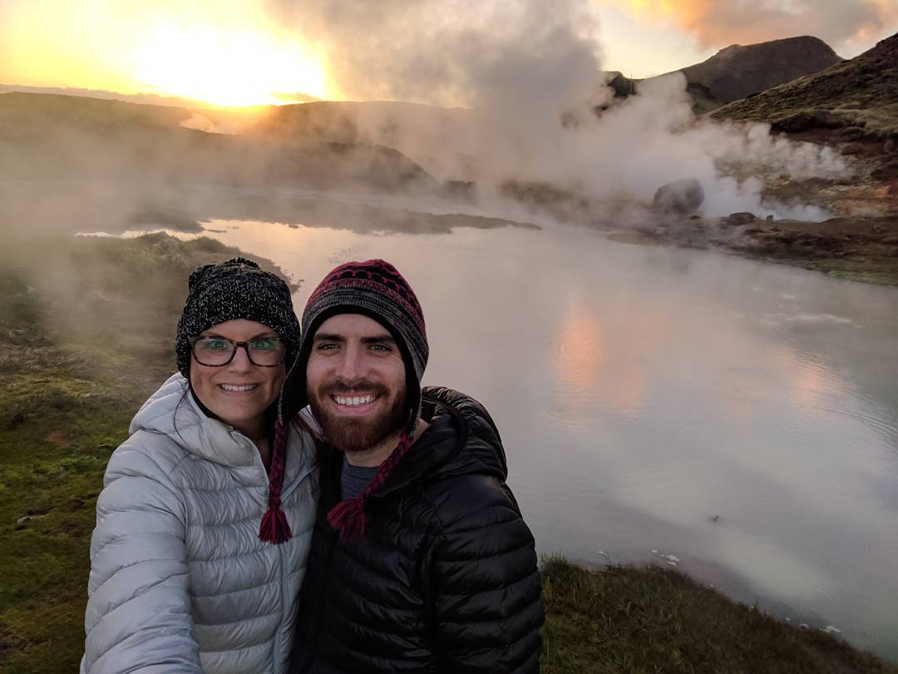

# Triangulate

A simple tool to pixelate a photo in triangles rather than squares.

**Input: [from instagram](https://www.instagram.com/p/BUK78uUFL8-nNzxV_I7SNkJJpCs_9BXBw-JFJ40/)**

**Output**

## Hooks

- score_hook.js: gives you a triangle, you return an number. <= 0 means we're done spliting this. Bigger numbers are split first.
- outlier_hook.js: gives you a triangle, you return the pixel in that triangle that should become a triangle's corner
- merge_hook.js: gives you two touching triangles, you return true to merge them and false to not merge them.
- paint_hook.js: gives you a triangle, lets you modify `this.data` for painting purposes

